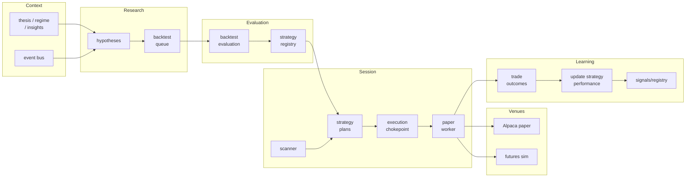

**Version:** workspace living document (no formal release numbering)  
**Audience:** operators, implementers, and collaborators who need a single narrative for *what* SynapTick is, *why* it is shaped this way, and *where* to find operational truth.

Operational contracts for scheduled agents and crons remain authoritative in `synaptick/core/AGENTS.md`. This document is the **programmatic overview**: it explains intent and architecture; it does not replace file-level contracts or environment-specific configuration.

[← SynapTick project overview](/project/synaptick)

---

## Executive summary

SynapTick is an **OpenClaw-hosted research and execution stack** for US session trading ideas. It combines (1) **human- and agent-authored context** (thesis, regime, insights, events), (2) **hypothesis discovery and queued backtests**, (3) **deterministic scanning and strategy routing** in `engine/`, (4) **paper brokerage execution** (Alpaca) and **local futures simulation** behind shared guardrails, and (5) **closed-loop learning** from both archived manual trades and automated paper/sim outcomes.

The **multi-strategy paper engine** generalizes the original ORB-centric path: multiple strategy *families* share the same evaluation queue schema, execution choke-point, risk limits, and outcome logging so new styles of edge can be tested and run without forking the operational pipeline.

---

## Motivation and problem statement

Discretionary and semi-automated trading systems tend to fail in one of two ways at scale: **brittle automation** (one strategy type, one code path, no safe way to experiment) or **uncontrolled sprawl** (many scripts, unclear promotion rules, no unified risk envelope).

SynapTick is designed to:

1. **Separate concerns** — discovery writes hypotheses; evaluation runs backtests; execution only consumes approved, guardrail-bounded intents; learning updates confidence from realized outcomes.
2. **Keep a single risk and idempotency story** — one configuration surface (`risk_limits.json`), one paper worker path, explicit execution modes (`off` / `dry_run` / `paper_active`).
3. **Close the loop** — promotions from backtests and adjustments from live paper outcomes are both explicit, logged, and bounded by rules rather than ad hoc edits.

---

## Design principles

| Principle                        | What it implies                                                                                                                                       |
| -------------------------------- | ----------------------------------------------------------------------------------------------------------------------------------------------------- |
| **Deterministic execution core** | Scanner, strategy plans, and order submission logic live in versioned Python; LLM agents supply research and formatting, not silent broker access.    |
| **Script-owned mutations**       | Critical merges (for example, queue status, registry promotion from backtests) are performed by designated scripts with documented rules.             |
| **Append-only research history** | Insights, discovery logs, and event trails accumulate with timestamps; agents are instructed not to erase history unless a file header allows it.     |
| **Strategy-agnostic routing**    | Order intents carry `strategy_type` and stable parameter identity for idempotency; new families extend evaluators and routing, not duplicate workers. |
| **Progressive exposure**         | Symbol allowlists, per-strategy position caps, and optional health-based auto-disable limit blast radius in paper mode.                               |

### Non-goals (as architected here)

- **Live cash execution** is not the default contract; paper and simulation venues are first-class.
- **Fully autonomous alpha search** without human or policy gates: discovery and promotion are bounded by queue rules, defaults, and `AGENTS.md` role contracts.
- **Cross-broker abstraction**: the documented path is Alpaca paper for equities/ETFs; futures sim is a separate venue with its own limits in `risk_limits.json`.

---

## System overview

End-to-end flow from context to learning:

**Narrative:** Context informs discovery. Discovery enqueues work. Evaluation drains the queue and may promote strategies into `strategy_registry.json`. During regular hours, the scanner and strategy layer produce plans; the paper execution worker is the only scheduled component allowed to submit paper orders, subject to mode and limits. Fills and decisions feed structured outcomes; post-close jobs aggregate performance and refresh salience and summaries.

---

## Strategy framework

### Strategy families

The system treats **strategy type** as a first-class label for both backtest items and live routing:

| Type                 | Intent (high level)                                                                        |
| -------------------- | ------------------------------------------------------------------------------------------ |
| `orb`                | Opening-range and breakout-style playbooks — the historical baseline.                      |
| `momentum_vwap`      | Directional momentum with VWAP confirmation and volume-based participation filters.        |
| `mean_reversion_rsi` | Fade extremes using RSI-style extension and mean reversion toward VWAP or similar anchors. |

Queue items use `eval_type` aligned with these families. Default pass thresholds and parameter templates live in `synaptick/research/discovery/discovery_eval_defaults.json`. Exact field requirements are specified in `synaptick/core/AGENTS.md`.

### Instruments and universe

Execution is intentionally constrained to **liquid, exchange-traded products** (for example broad index ETFs such as `QQQ` and `SPY`, and optionally sector ETFs) via allowlists in `synaptick/core/risk_limits.json`. The paper worker enforces the allowlist for all strategy types so expansion of the universe is a **policy change**, not a code fork.

---

## Data, features, and learning

### Two complementary learning loops

1. **Historical trade archive → signal registry**
  Closed trades recorded under `trades/` feed `learning/update_signals.py`, which regenerates `signals/registry.json` and the readable summary `learning.md`. This captures long-run performance of named signal styles tied to human- or system-attributed trade records.
2. **Paper and sim outcomes → strategy performance**
  The paper worker appends structured rows to `synaptick/research/features/trade_outcomes.jsonl`. `synaptick/scripts/update_strategy_performance.py` (post-close cron) aggregates by strategy family, symbol bucket, and regime where applicable, and updates `synaptick/research/features/strategy_performance_summary.json`, `signals/registry.json`, and narrative hooks in `synaptick/core/insights.md` per script behavior.

Together, these loops support **promotion** (backtests and rules), **runtime adaptation** (rolling expectancy and health), and **auditability** (JSONL and append-only logs).

### Supporting data pipeline

Macro sentiment, FRED series, feed and arXiv ingests, and feature exports are staged through scripts documented in `synaptick/core/AGENTS.md`. That pipeline grounds regime classification (`core/regime.md`) and optional mining outputs used by discovery prompts.

---

## Risk, safety, and governance

### Execution modes

The worker refuses to send live orders unless configuration explicitly allows **paper active** mode; `dry_run` and `off` exist to support rehearsal and shutdown. When `paper_only_required` is set in `risk_limits.json`, the stack assumes Alpaca paper — a deliberate guard against accidental live routing.

### Limits and health

`risk_limits.json` centralizes max open positions, per-strategy caps, daily trade and loss limits, symbol allowlists, and optional **strategy health** automation. Optional midday jobs can disable weak strategy *families* under declared rules while preserving a conservative ORB baseline, as described in `AGENTS.md`.

### Promotion and demotion

- **From backtests:** `process_backtest_queue.py` may merge into `synaptick/core/strategy_registry.json` only when evaluation status and metric thresholds pass; this is distinct from signal salience in `signals/registry.json` driven by `update_signals.py`.
- **From outcomes:** Post-close performance updates and health checks provide **runtime demotion** signals without silently deleting historical records.

---

## Automation roles and human oversight

OpenClaw maps workloads to **role-scoped agents** (`research`, `synaptick-discovery`, `synaptick-evaluator`, `executor`) so sessions stay isolated: discovery does not place trades; the executor does not invent hypotheses. Cron identifiers, Discord delivery conventions, and forbidden actions are enumerated in `synaptick/core/AGENTS.md`.

Humans remain in the loop through **thesis and playbook files**, **risk configuration**, **queue inspection**, and **review of promotions** before any hypothetical transition beyond paper.

---

## Repository map

| Path                      | Purpose                                                                                                                |
| ------------------------- | ---------------------------------------------------------------------------------------------------------------------- |
| `engine/`                 | Scanner, strategy planning, execution choke-point.                                                                     |
| `synaptick/scripts/`      | Workers: queue processing, paper and futures-sim execution, learning, ingest, charts.                                  |
| `synaptick/core/`         | Thesis, regime, logs, insights, `strategy_registry.json`, `risk_limits.json`, `[AGENTS.md](synaptick/core/AGENTS.md)`. |
| `synaptick/research/`     | Discovery queue, hypotheses, features, models, ingested data.                                                          |
| `synaptick/cron/prompts/` | Scheduled job prompt text.                                                                                             |
| `synaptick/state/`        | Idempotency and venue-local state.                                                                                     |
| `synaptick/logs/`         | Fills, executor output, chart artifacts.                                                                               |
| `signals/`                | `registry.json` — salience and tiers.                                                                                  |
| `trades/`                 | Closed-trade markdown for learning.                                                                                    |
| `skills/`                 | Workspace skills (e.g. Backtrader conventions).                                                                        |

---

## Evolution and historical context

A **multi-strategy paper engine** expansion (generalized queue schema, new evaluators, sector ETF allowlists, strategy-agnostic routing, outcome sink, post-close learning and optional health crons) was planned and executed as a staged rollout; acceptance criteria included non-ORB hypotheses in the queue, paper orders for new families under shared guardrails, outcome logging, and safe degradation of weak families. Design and gate discussion for that effort is preserved under the `/plans/` directory.

---

## References

| Document                                               | Role                                                                                               |
| ------------------------------------------------------ | -------------------------------------------------------------------------------------------------- |
| `synaptick/core/AGENTS.md` | Authoritative agent/cron contract, queue schema summary, pipeline table, promotion/demotion rules. |
| `learning.md`                           | Readable summary of `signals/registry.json`.                                                       |
| `AGENTS.md`                               | General OpenClaw workspace session and memory conventions.                                         |

---

*This overview is maintained as a companion to the codebase. When behavior and documentation diverge, trust the executable scripts and `AGENTS.md`; update this file when the high-level story changes.*
