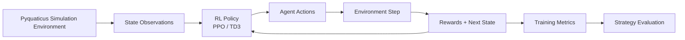

This project explores multi-agent reinforcement learning within the **Pyquaticus** simulation environment used for the Maritime Capture the Flag challenge. The goal is to develop learning-based agents capable of coordinating offensive and defensive behaviors, adapting to adversarial strategies, and operating in dynamic environments.

The work focuses on designing training pipelines, reward shaping strategies, and hierarchical behaviors that allow autonomous agents to learn cooperative gameplay strategies through simulation.

---

## Overview

Maritime Capture the Flag is a robotics challenge in which teams of autonomous surface vehicles attempt to capture the opposing team’s flag while defending their own. Agents must navigate adversarial environments, avoid defenders, and coordinate strategies under real-time constraints.

To explore these challenges, this project implements reinforcement learning agents trained in simulation using **Pyquaticus**, a multi-agent maritime robotics environment.

The objective is to develop agents capable of:

- Coordinated offensive and defensive strategies  
- Autonomous navigation in adversarial environments  
- Learning robust policies through simulation-based training

---

## Highlights

- **Multi-agent reinforcement learning** using PPO and TD3 for cooperative and competitive gameplay
- **Hierarchical behavior design** enabling agents to switch between offense and defense roles
- **Reward shaping experiments** to encourage strategic coordination and stable learning
- **Simulation-first development** using the Pyquaticus environment for experimentation
- **Evaluation pipelines** to analyze match performance and policy behavior

---

## Learning Pipeline

The training pipeline combines simulation, reinforcement learning training, and iterative evaluation.

Agents interact with the simulation environment by observing state information, selecting actions through learned policies, and updating their behavior based on reward signals and performance metrics.

---

## System Architecture

Key components of the system include:

| Component              | Description                                                                     |
| ---------------------- | ------------------------------------------------------------------------------- |
| Simulation Environment | Pyquaticus maritime capture-the-flag simulator                                  |
| Agents                 | Reinforcement learning controlled autonomous surface vehicles                   |
| Policy Training        | PPO and TD3 experiments for multi-agent coordination                            |
| Reward Shaping         | Custom reward functions encouraging capture, defense, and navigation strategies |
| Evaluation             | Simulation metrics and match outcomes used to compare policy performance        |

---

## Technologies

- Python
- PyTorch
- Reinforcement Learning (PPO / TD3)
- Pyquaticus simulation environment
- Multi-agent systems

---

## Repositories

- **2025 Implementation**   
[https://github.com/lmckane/MCTF2025](https://github.com/lmckane/MCTF2025)
- **2026 Implementation (ongoing)**     
[https://github.com/lmckane/MCTF2026](https://github.com/lmckane/MCTF2026)

---

## Status

Active experimentation with multi-agent reinforcement learning strategies and reward shaping techniques for autonomous robotics competitions.

---

## Related Work

This project draws inspiration from research in multi-agent reinforcement learning, hierarchical decision-making, and autonomous robotics coordination.

- **Hierarchical Reinforcement Learning** — A framework for structuring policies into multiple levels of abstraction, allowing high-level policies to coordinate lower-level behaviors.  
[https://medium.com/data-science/hierarchical-reinforcement-learning-56add31a21ab](https://medium.com/data-science/hierarchical-reinforcement-learning-56add31a21ab)
- **Reward Shaping for Improved Learning in Real-time Strategy Game Play** — Research exploring reward shaping techniques to stabilize reinforcement learning in adversarial environments.  
[https://arxiv.org/abs/2311.16339](https://arxiv.org/abs/2311.16339)
- **Evaluating Collaborative Autonomy in Opposed Maritime Capture-the-Flag Scenarios** — Research examining autonomous multi-agent coordination in maritime capture-the-flag competitions.  
[https://arxiv.org/abs/2404.17038](https://arxiv.org/abs/2404.17038)

These works provide useful insights into hierarchical policy design, reward shaping strategies, and cooperative autonomy in adversarial multi-agent environments.