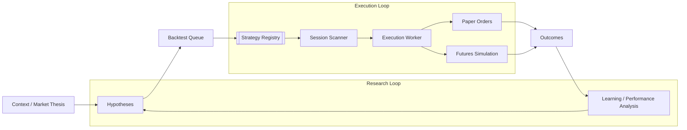

**Multi-strategy research and paper execution for US session ETFs** — from hypothesis discovery and backtesting to guarded paper execution and outcome-driven learning.

SynapTick treats trading automation as a systems engineering problem: **separate discovery, evaluation, and execution**, enforcing **explicit promotion rules**, and **closing the loop** on real outcomes from paper trading and simulation. The goal is to avoid brittle single-strategy bots and instead maintain a reproducible research pipeline for testing and promoting new ideas.

---

## Highlights

- **Strategy families** — Opening-range-style playbooks, momentum with VWAP confirmation, and mean-reversion frameworks share the same pipeline: one queue, one execution path, shared guardrails.
- **Deterministic core** — Scans, plans, and broker-facing logic live in versioned code; agents assist with research and narrative, not unchecked order placement.
- **Paper-first** — Designed around **paper brokerage** and **local futures simulation** with explicit execution modes (off, dry-run, paper-active).
- **Closed-loop learning** — Trade archives and structured paper/sim outcomes feed rolling performance views and signal salience, with post-close updates and optional health checks to automatically disable underperforming strategy families.
- **Progressive risk** — Symbol allowlists, caps on open positions and trades, daily loss limits, and optional auto-disable paths limit blast radius while experimenting.

---

## How it fits together

At a high level: **context** (thesis, regime, insights, events) informs **hypotheses**, which enter a **backtest queue**. Passing ideas can graduate into a **strategy registry**. During the session, a **scanner** and **strategy layer** produce order **intents**; a **single execution worker** applies limits and may submit **paper** orders or run the **futures sim**. **Outcomes** are logged and aggregated so performance feeds back into confidence and documentation — not ad hoc edits.

---

## Stack (high level)

| Layer | Notes |
|--------|--------|
| Language / runtime | Python for workers, scans, and backtests |
| Brokerage (paper) | Alpaca paper for equities / ETFs |
| Simulation | Separate futures-sim venue with its own limits |
| Orchestration | Scheduled jobs and role-scoped agents (e.g. discovery vs executor) |
| Data | Append-only logs, feature rows, and outcome sinks for learning |

---

## Status

**Active research and paper trading** — not a product, not a signal service. The goal is reproducible experimentation and honest accounting of results in constrained, non-live environments unless you deliberately change that policy.

---

## Links

- **System architecture & design rationale:** [SynapTick design overview](/project/synaptick/design/)
- **Contact:** <a href="#" class="project__contact-link">Use this contact form!</a>

---

## Disclaimer

SynapTick is for **education and research** only. Nothing here is investment, tax, or legal advice. Past backtest or paper performance does not guarantee future results. Trading involves substantial risk; use paper and simulation until you fully understand behavior and limits.

---

_SynapTick is a personal project showcase. Naming and scope reflect the author’s stack, not an offer to manage capital or provide recommendations._
